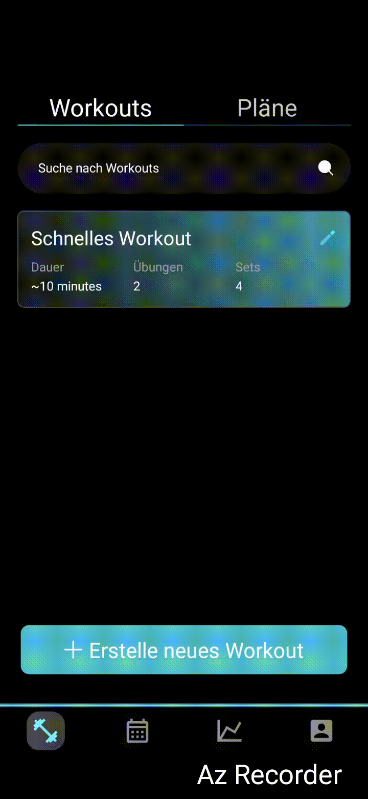
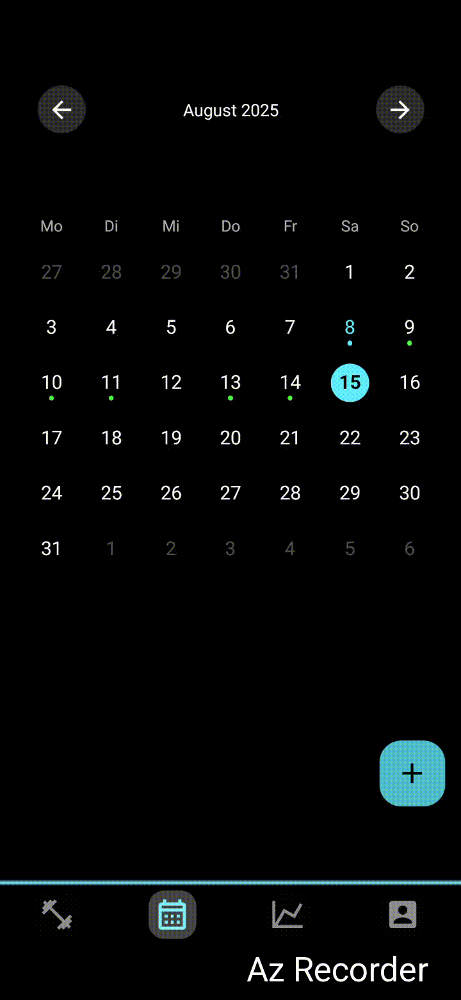
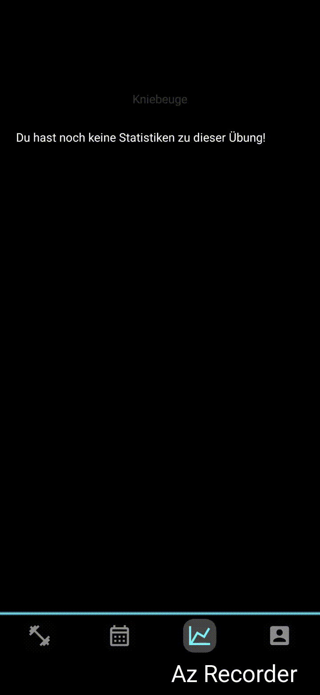

# fitnessTracker

**Ein minimalistischer Fitness-Tracker mit React Native & Supabase**, erstellt mit Expo – ideal zum Verfolgen deiner Workouts und Performance.

---

##  Schnelle Vorschau

<p align="center">
  
  
  
</p>

> **Bei GitHub werden die Bilder automatisch skaliert**, aber die Verwendung von `` mit einem `width`-Attribut sorgt dafür, dass sie gleichmäßig und passend dargestellt werden – perfekt fürs README.

---

##  Funktionen auf einen Blick

- **Workout aufzeichnen**: Erstelle, sammele und speichere deine Trainingseinheiten.
- **Echtzeitstatistiken**: Anzeige von Fortschritt, Wiederholungen, Dauer und mehr.
- **Supabase Integration**: Schnelle Synchronisierung und Authentifizierung via Supabase.
- **Cross-Plattform**: Läuft unter Android & iOS via Expo.

---

##  Installation & Inbetriebnahme

```bash
git clone https://github.com/jakobr0cky/fitnessTracker.git
cd fitnessTracker
npm install

# Debug-Modus starten:
npx expo start
